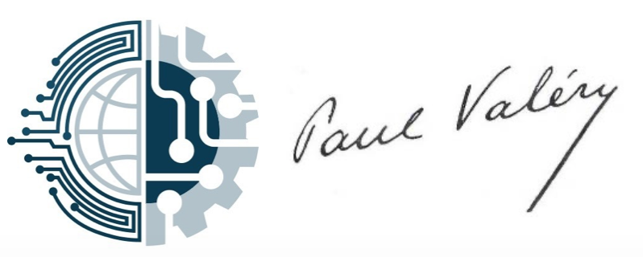
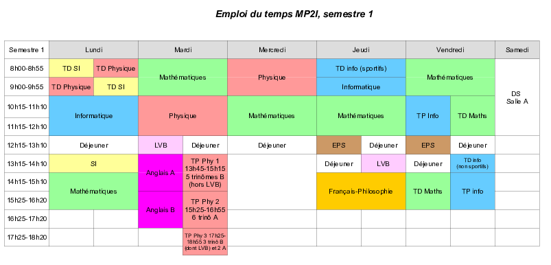

<h1>La filière MP2I / MPI / MPI* du lycée </h1>

(... site en construction ...)

**Résultats au concours.** La filière MP2I/MPI est jeune: elle a été créée à la
rentrée de septembre 2021. Les premiers concours de la filière ont
lieu en 2023, il n'existe donc pas encore de résultats de concours.

Le processus d'attribution des places n'est pas encore terminé pour
les concours 2023, mais nous pouvons déjà annoncer quelques résultats :

effectif 2022-2023 : 11 MPI* / 16 MPI

* MPI\*
  * des admis aux écoles suivantes (ENS sur dossier: Ulm en
  informatique, Rennes en mathématiques) :
  

  
  
      
      
    
    
  
      
  

  
  * 6 admissibles Mines-Ponts (et MT) + 5 admissibles
    Mines-Telecom (dont 1 qui est au-dessus de la barre MP mais ne s'est
   pas inscrit) / 8 admissibles CCINP (9 candidats) / Centrales : 1
   admissible Lyon, en-dessous globalement entre 66% et 100% des
   inscrits admissibles
   
   * bilan des intégrations : 1 ENS Ulm informatique sur dossier, 1
    ENS Rennes mathématiques sur dossier, 2 Telecom Paris, 1 ensimag,
    1 Centrale Lille, 1 ENSEEIHT, 1 Mines Saint Etienne, 1 Mines Alès,
    1 élève qui a choisi d'aller en L3 Math et 1 élève qui a choisi de faire 5/2

* MPI
  * des admis aux écoles suivantes :
  

      
        
      
      
      
      
  

  * 1 admissible au BECEAS (1 candidat)
  * 2 admissibles Mines-Telecom (et MTS) + 7 admissibles
    Mines-Telecom spécifique / 7 admissibles CCINP / 2 admissibles ENSEA
   (6 candidats)
   * bilan des intégrations : 1 ENSAI, 3 ISIMA, 1 Telecom Saint
   Etienne, 1 Polytech Sorbonne, 3 ESILV, 1 EFREI, 1 élève qui a
   choisi d'aller en L2 math et 3 élèves qui ont choisi de faire 5/2

## La filière.

Comme toutes les MP2I, celle de Paul Valéry permet
d'accéder en deuxième année en MPI ou MPI* (ainsi qu'en MP et PSI pour
ceux qui auraient pris l'option SI/chimie au second semestre de
MP2I). Le <a href="https://prepas.org/?article=42" target="_blank">détail des horaires</a>.

## Une semaine en MP2I à PV c'est...

* des cours passionnants du lundi au vendredi; ici l'emploi du temps du
   premier semestre 22-23:
   
   

Remarquez qu'il n'y a pas que des cours magistraux en prépa, mais aussi des
TD et des TP.

* deux heures de colles par semaine (khôlles si vous aimez le folklore).
   Une colle, c'est une heure, trois étudiant(e)s, un(e) prof, plein de
   sciences*

   (* il y a aussi des colles de langues et de Français!)
   
   exemple de [programme de colle de physique](semaine_2023-05-15.pdf)
* un devoir sur table le samedi matin (par exemple ce [DS
  d'informatique](ds3_2022-2023.pdf), inspiré de l'épreuve d'option
  informatique MP CCINP 2021 et de l'épreuve
  d'informatique MP/PC X/ESPCI 2010)

* du travail à la maison (par exemple ce [DM de maths](DM_17.pdf))

* le tout dans une ambiance conviviale : entraide et bonne humeur
  conseillées
  

 
La promo 2022-2023 absorbée par la première épreuve du concours
blanc

## Je suis admis(e) en MP2I à PV (la chance !): que faire cet été?

1. Se reposer et profiter du soleil.

2. Lire [les livres du programme de Français-Philosophie](https://www.enseignementsup-recherche.gouv.fr/fr/bo/2023/Hebdo28/ESRS2317934A). Au programme
   en 2023-2024 (attention : le programme ne contient que le thème 2):
   * _Lorenzaccio_ d'A. de Musset
   * _Les liaisons dangereuses_ de Ch. de Laclos
   * _Vérité et politique_ (sortie prévue en juillet) et « Du mensonge
     en politique » dans _Du mensonge à la violence_ de H. Arendt
     
     Les <a href="https://cahier-de-prepa.fr/mp2i-pv/download?id=1149">conseils de l'enseignant</a>.
   
3. Si vous y tenez, faire quelques révisions du programme de lycée, par
   exemple en travaillant <a href="https://colasbd.github.io/cdc/" target="_blank">un peu les
   maths</a> ou <a href="https://colasbd.github.io/cde/" target="_blank">un peu la
   physique</a>. Si vraiment vous voulez
   travailler un peu l'informatique, faites du `python`
   <a href="https://www.france-ioi.org/" target="_blank">ici</a>,
   <a href="https://www.codewars.com/?language=python" target="_blank">là</a>, ou bien
   <a href="https://www.codingame.com/start" target="_blank">là</a> (pas de `C`, et surtout pas
   d'`ocaml` tout(e) seul(e)).
   
   Mais surtout se reposer : l'important est d'arriver en forme et motivé(e) en
   septembre.

<a
href="https://pia.ac-paris.fr/serail/jcms/s2_1627631/fr/cite-scolaire-paul-valery"
target="_blank">site du lycée</a>
/ <a
href="https://www.onisep.fr/formation/apres-le-bac-les-etudes-superieures/ma-premiere-annee-en/ma-premiere-annee-en-prepa/prepa-mp2i-mathematiques-physique-ingenierie-et-informatique"
target="_blank">reportage onisep</a>
/ <a href="https://prepas.org/" target="_blank">prepas.org</a>

