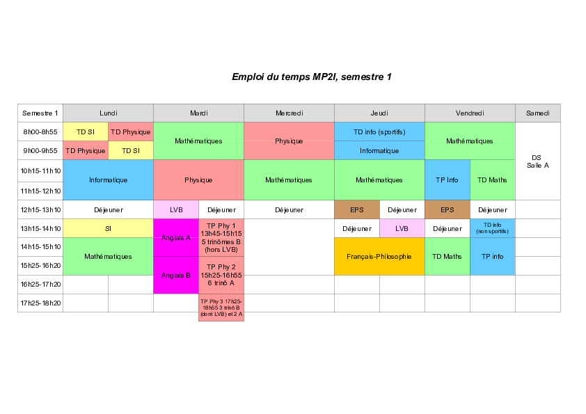

La filière MP2I / MPI / MPI* du lycée Paul Valéry
=====

(... site en construction ...)

La [page du lycée](https://pia.ac-paris.fr/serail/jcms/s2_1627631/fr/cite-scolaire-paul-valery).

**Résultats au concours.** La filière MP2I/MPI est jeune: elle a été créée à la
rentrée de septembre 2021. Les premiers concours de la filière ont
lieu en 2023, il n'existe donc pas encore de résultats de concours.

**La filière.** Comme toutes les MP2I, celle de Paul Valéry permet
d'accéder en deuxième année en MPI ou MPI* (ainsi qu'en MP et PSI pour
ceux qui auraient pris l'option SI/chimie au second semestre de MP2I).

## Une semaine en MP2I à PV c'est...

* des cours passionnants du lundi au vendredi; ici l'emploi du temps du
   premier semestre 22-23:
   
   

* deux heures de colles par semaine (khôlles si vous aimez le folklore).
   Une colle, c'est une heure, trois étudiant(e)s, un(e) prof, plein de
   sciences*

   (* il y a aussi des colles de langues et de Français!)
   
   exemple de [programme de colle de physique]()
* un devoir sur table le samedi matin (par exemple ce [DS d'informatique](ds3_2022-2023.pdf))

* du travail à la maison (par exemple ce [DM de maths](DM_17.pdf))

## Je suis admis en MP2I à PV (la chance !): que faire cet été?

1. Se reposer.

2. Lire les livres du programme de Français (lien vers une liste sur
   Cahier de prépa, car l'info publiée au BO au mois de mai est toujours
   peu claire puisqu'elle donne aussi le thème de l'année $n-1$,
   théoriquement au programme des concours).
   
3. Si vous y tenez, faire quelques révisions du programme de lycée, par
   exemples en travaillant sur ce [cahier de calcul](). Mais surtout
   se reposer : l'important est d'arriver en forme et motivé en
   septembre.

